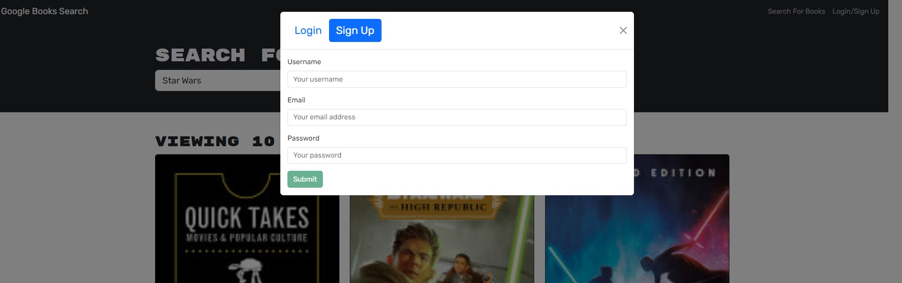
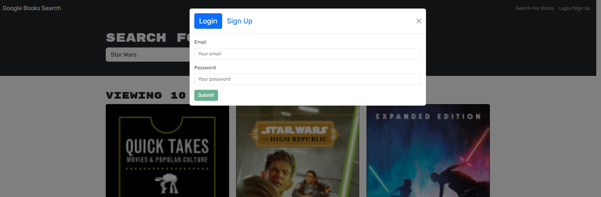

# MERN: Book Search Engine

## Description

This project is a book search engine built using the MERN stack. It allows users to search for books using the Google Books API, save their favorite books, and view them later. The application has been refactored from a RESTful API to a GraphQL API using Apollo Server. Visit [Book Search](https://booksearch-vrtc.onrender.com).
)

## Table of Contents

- [Usage](#usage)
- [Technologies Used](#technologies-used)
- [Screenshots](#screenshots)
- [Troubleshooting](#troubleshooting)
- [License](#license)

## Usage

1. Open your browser and navigate to `http://localhost:3001`.
2. Use the search bar to find books using the Google Books API.
3. Save your favorite books to view them later.

## Technologies Used

- MongoDB
- Express.js
- React.js
- Node.js
- GraphQL
- Apollo Server
- Apollo Client
- Google Books API

## Screenshots

### Example "Star Wars" search

### Signup

### Login

## License

This project is licensed under the MIT License.

## Author

Developed by [Ralph Molu](www.linkedin.com/in/ralph-molu)